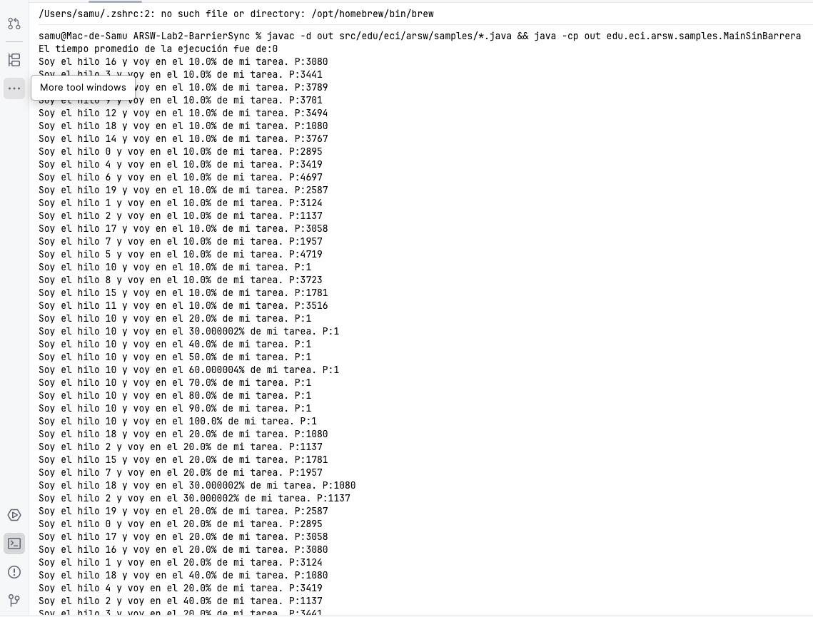
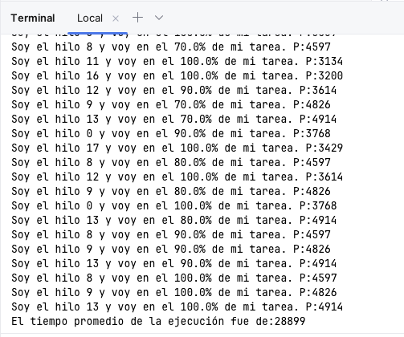

# ARSW Lab 2 – Sincronización por Barrera (Barrier Sync)

**Nombre:** Samuel Gil  
**Materia:** Arquitecturas de Software (ARSW)  
**Institución:** Escuela Colombiana de Ingeniería

---

## Descripción

El programa lanza N hilos que ejecutan una misma tarea iterativa a velocidades distintas (tiempo de espera aleatorio por hilo). Al finalizar, se calcula el promedio de los tiempos de ejecución de todos los hilos.

---

## El problema sin barrera

En el código original, el hilo principal intenta leer `getResultado()` de cada hilo inmediatamente después de lanzarlos con `start()`. Como los hilos todavía están corriendo en ese momento, el campo `resultado` sigue siendo `0` en todos ellos. El promedio calculado es **0 ms**, lo cual es incorrecto.



---

## La solución – Patrón Barrier Sync con `join()`

Se agrega un bloque de sincronización entre el `start()` de los hilos y el cálculo del promedio. El método `join()` bloquea el hilo principal hasta que cada hilo termine su ejecución. Una vez que todos han terminado, se acumulan y promedian los tiempos reales.

```java
for (int i = 0; i < numHilos; i++) {
    hilos[i].join();
}
```

Esto garantiza que `getResultado()` se llame solo después de que cada hilo haya asignado su valor a `resultado`.



---

## Cómo compilar y ejecutar

**Desde terminal:**

```bash
mkdir -p out
javac -d out src/edu/eci/arsw/samples/*.java
java -cp out edu.eci.arsw.samples.Main
```

**Desde IntelliJ IDEA:** abrir el proyecto, marcar `src` como Sources Root y ejecutar `Main.java`.

---

## Estructura del proyecto

```
src/
└── edu/eci/arsw/samples/
    ├── HiloProc.java   # Hilo que ejecuta la tarea iterativa
    └── Main.java       # Punto de entrada – lanza hilos y calcula promedio
img/
    ├── output-sin-barrera.png
    └── output-con-barrera.png
```
